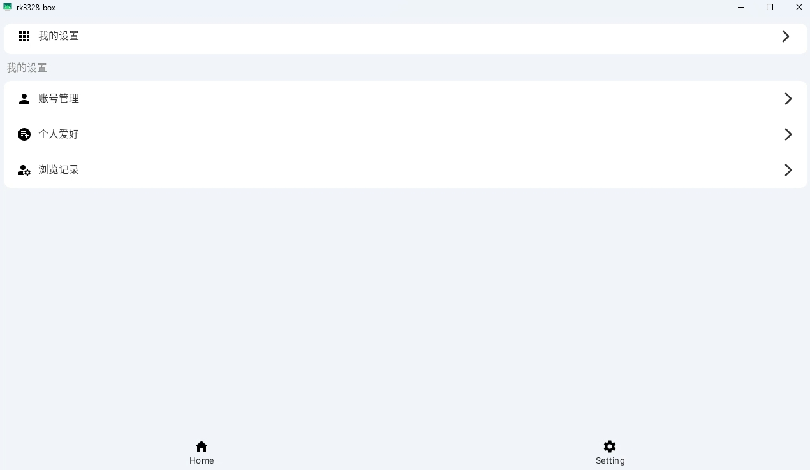

# 参考
[1、Android 设置页面的设计](https://blog.csdn.net/team2010/article/details/8204420?spm=1001.2101.3001.6650.2&utm_medium=distribute.pc_relevant.none-task-blog-2%7Edefault%7EBlogCommendFromBaidu%7ERate-2-8204420-blog-95817438.235%5Ev43%5Epc_blog_bottom_relevance_base8&depth_1-utm_source=distribute.pc_relevant.none-task-blog-2%7Edefault%7EBlogCommendFromBaidu%7ERate-2-8204420-blog-95817438.235%5Ev43%5Epc_blog_bottom_relevance_base8&utm_relevant_index=5)